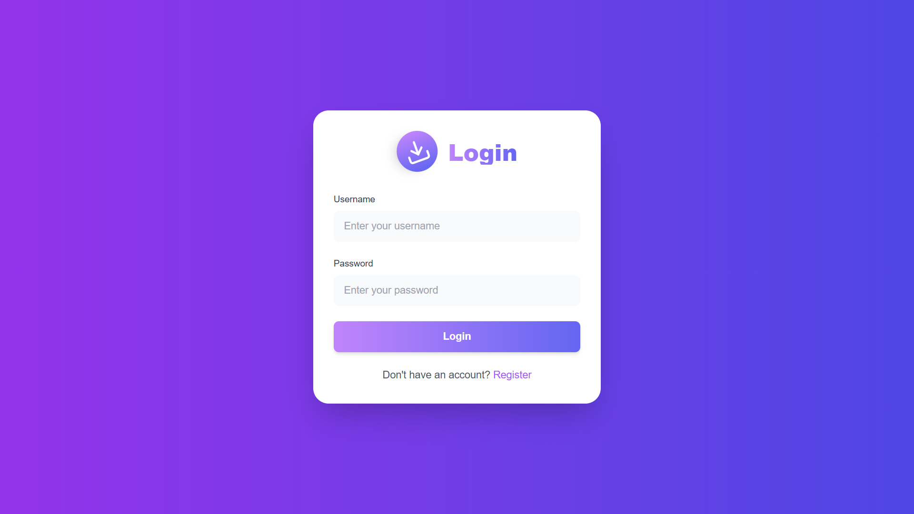
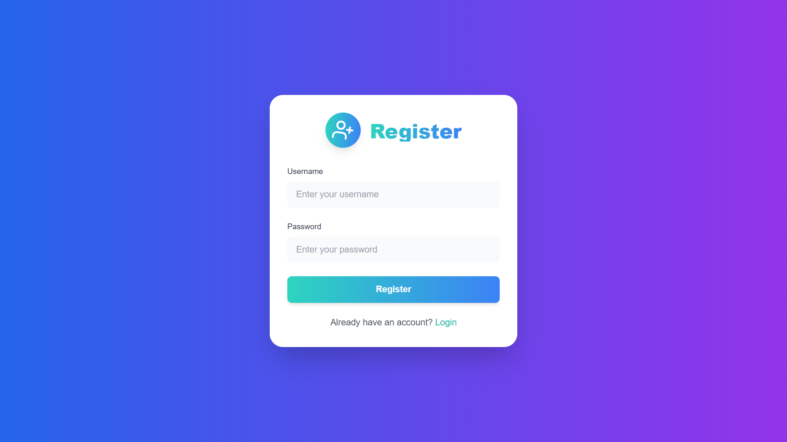
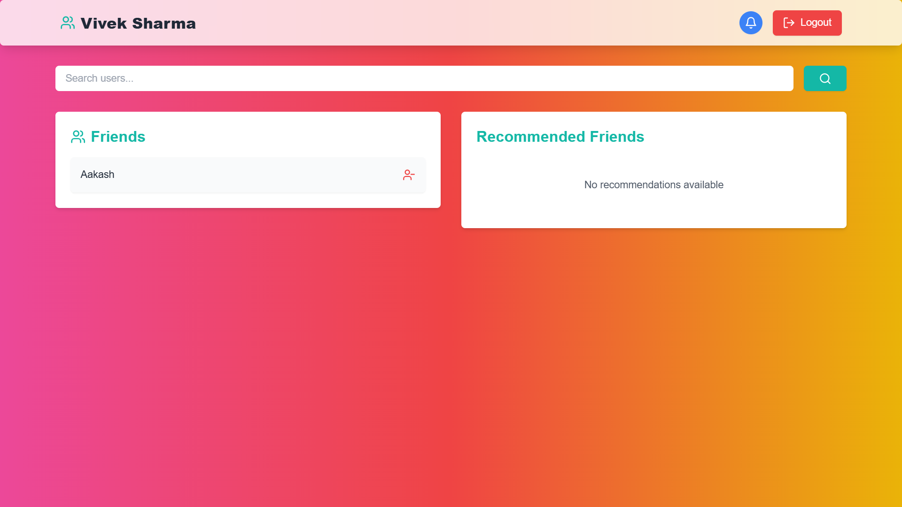

# 🌐 **Friendzone**  


---
    
### 🫂 **A Modern Social Networking Platform**  
    
---
    
## 📖 **Description**  
    
**Friendzone** is a contemporary social network application where users can connect, send friend requests, and manage friendships seamlessly. Built with **React**, **Node.js**, and **MongoDB**, it offers a responsive and dynamic user experience. Whether you're looking to expand your social circle or maintain connections with existing friends, Friendzone provides the tools you need to do so effortlessly.  
    
---
    
## 📂 **File Structure**  

### 🎨 **Frontend**  

bash
client/
public/
  index.html
src/
  components/
    PrivateRoute.tsx
    ...
  contexts/
    AuthContext.tsx
    ...
  pages/
    Home.tsx
    Login.tsx
    Register.tsx
    ...
  App.css
  App.tsx
  index.css
  main.tsx
package.json
postcss.config.js
tailwind.config.js
tsconfig.app.json
tsconfig.json
vite.config.ts


### 🛠️ **Backend**  

bash
server/
  models/
    User.js
    ...
  routes/
    auth.js
    friends.js
    users.js
    ...
  middleware/
    auth.js
    ...
  index.js
package.json
vercel.json


---

## 🖼️ **Screenshots**  


### 🔐 **Login Page**  
  

### ✍️ **Register Page**  
  

### 🏠 **Home Page**  
  

---
        
## ✨ **Features**  
        
- 🔒 **User Authentication and Authorization**  
- 🤝 **Friend Request System**  
- 🧑‍🤝‍🧑 **Friendship Management**  
- 🔍 **User Search and Filtering**  
- 📱 **Responsive Design**  
- 📢 **Real-time Notifications**    
- 🌐 **Cross-Platform Compatibility**  
        
---
        
## ⚙️ **Installation**  
        
### 🎨 **Frontend**  
        
1. **Clone the repository:**  
   ```bash
   git clone https://github.com/VivekSharma2003/FriendZone.git